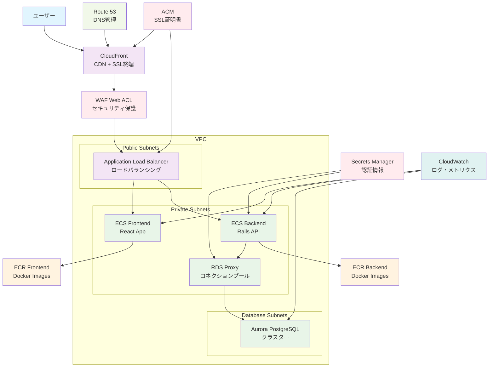
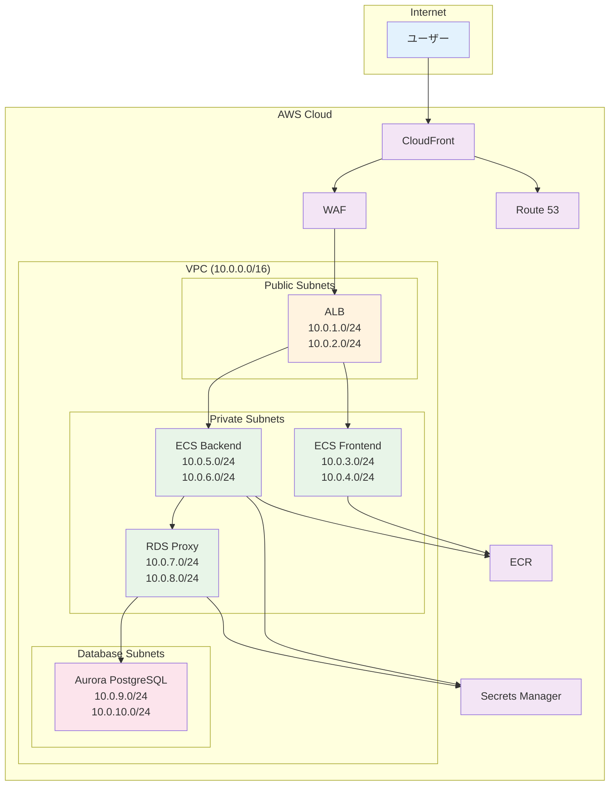
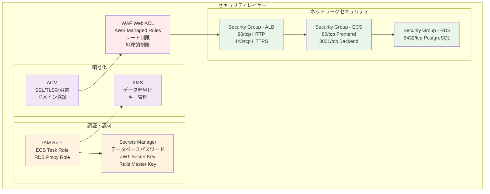
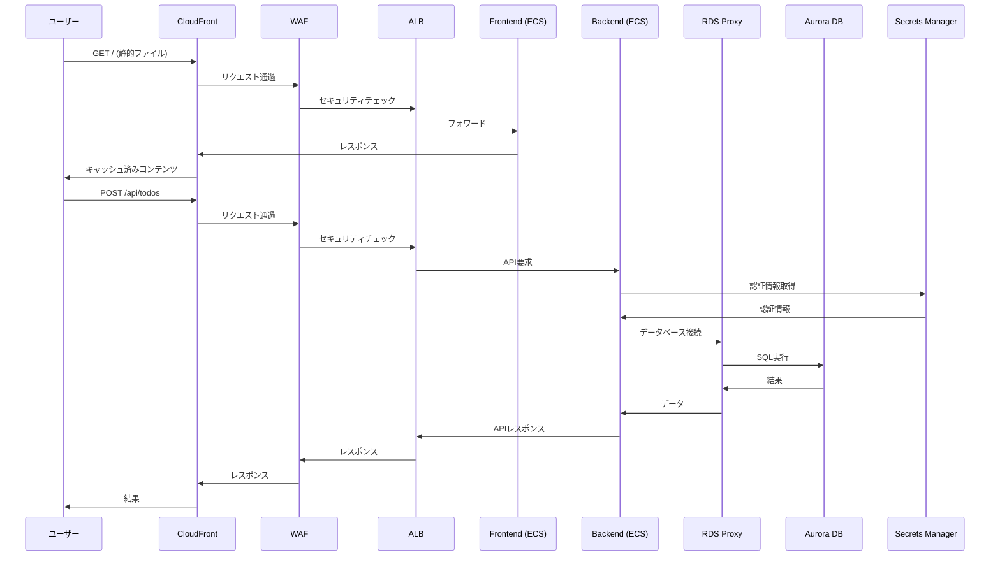

# Todo App インフラ構成図

## 全体構成図

## ネットワーク構成図

## セキュリティ構成図

## データフロー図

## コンポーネント詳細

### フロントエンド (React)
- **コンテナ**: ECS Fargate
- **ポート**: 80
- **ヘルスチェック**: `/`
- **キャッシュ**: 静的ファイル（JS/CSS/画像）は長期キャッシュ

### バックエンド (Rails API)
- **コンテナ**: ECS Fargate
- **ポート**: 3001
- **ヘルスチェック**: `/health`
- **キャッシュ**: APIはキャッシュなし

### データベース (Aurora PostgreSQL)
- **エンジン**: Aurora PostgreSQL 15.10
- **インスタンス**: db.t4g.medium × 2
- **接続**: RDS Proxy経由
- **バックアップ**: 7日間保持

### セキュリティ
- **WAF**: AWS Managed Rules + レート制限
- **証明書**: ACM (us-east-1 for CloudFront, ap-northeast-1 for ALB)
- **暗号化**: 転送時・保存時両方で暗号化
- **IAM**: 最小権限の原則

### 監視・ログ
- **CloudWatch**: メトリクス・ログ収集
- **ALB**: アクセスログ
- **ECS**: タスクログ
- **RDS**: パフォーマンスインサイト
